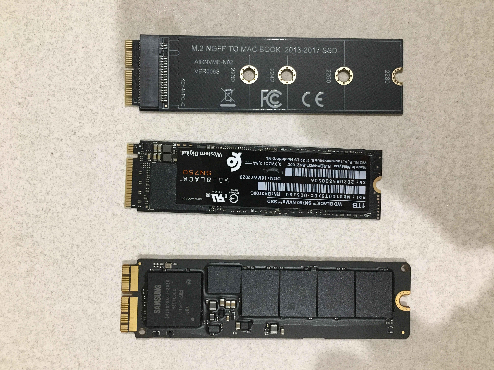
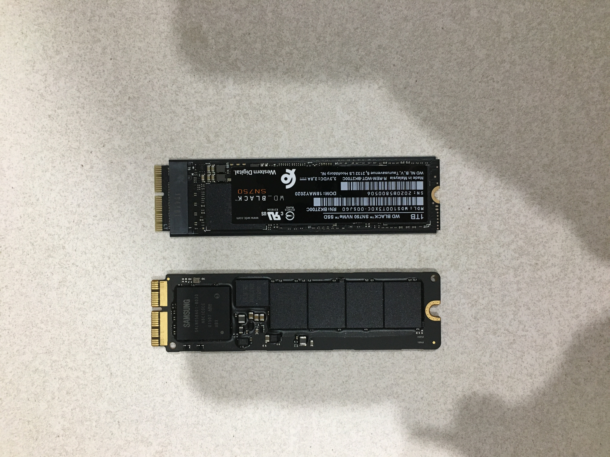
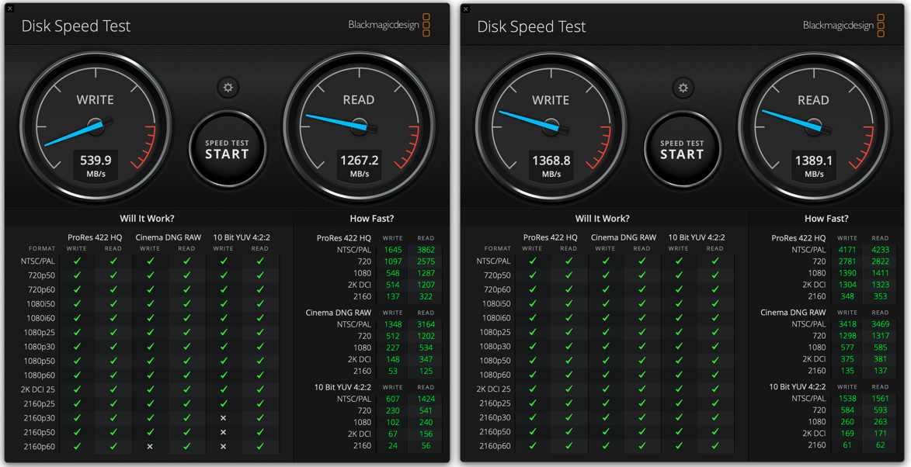

> 맥북을 쓰다보니 가끔 윈도우의 필요성을 느낀다. 하지만 지금 맥북은 SSD의 용량이 256GB라서 부트캠프로 윈도우를 설치하기엔 용량이 모자라다. 알아보니 다행히 SSD 업그레이드가 가능하다고 한다!

## 시작

최근에 맥북이 버벅거려서 새로운 맥북을 들이려다가 가격을 보고 다시 한 번 고민하기로 했습니다.
지금 노트북을 조금만 정비하면 더 쓸 수 있을 것 같아서 업그레이드가 가능한 부분을 알아보았습니다.
마음같아선 메모리를 현재 8GB에서 16GB로 증설하고, SSD 용량을 늘리고 싶었지만, 제 모델은 메모리 업그레이드가 불가능하다고 합니다.
그래서 SSD만 업그레이드 하기로 했습니다.

## SSD 업그레이드 가능 모델

1. 2.5인치 SSD 사용 모델
 레티나 버전이 아닌 맥북프로는 일반 노트북과 유사한 구조를 가지고 있어서, SSD (2.5인치) 뿐만 아니라 메모리, ODD 까지도 업그레이드를 할 수 있습니다.

2. NVME SSD 사용 모델
    - MacBook Pro **with Retina** (Late 2013 - 2015)
    - MacBook Air (Mid 2013 - 2017)
    - Mac Pro (Late 2013 - 2019)
    - Mac mini (Late 2014)
    - iMac 27" (Late 2013 - Current)
    - iMac 21.5" (Late 2013 - Current)

위 모델은 맥용 SSD 판매사이트 (macsales) 에서 참고했습니다.

## 맥북 SSD 업그레이드시 주의할 점

1. 맥에서 사용되는 NVME SSD 슬롯은 일반 NVME SSD 슬롯과 핀 배열이 다릅니다. 따라서 어댑터를 사용하시던지, 아니면 맥 전용으로 나온 SSD를 구매하셔야 합니다.

2. SSD를 구매 하실 때 맥과 호환성 이슈를 체크하시고 안전한 모델을 구매하셔야 합니다.

3. 맥이 지원하는 최대 속도가 모델별로 다릅니다. 따라서 용량증설 외에 속도면에서의 향상은 모델마다 한계가 있습니다.

4. macOS는 High Sierra (10.13) 이상 버전을 사용하셔야 합니다.

5. 모델별로 인터넷으로 macOS 재설치 불가, 잠자기모드 사용 불가등 오류가 발생 할 수 있으므로, 본인 모델에서 발생 할 수 있는 문제점들에 대비하셔야합니다.

## 맥북 SSD 업그레이드 성공기

### 1. SSD + 어댑터 구매

맥북 전용으로 나온 SSD들은 일반 SSD에 비해서 가격이 2~3배가량 비쌌습니다. 그래서 일반 SSD와 어댑터를 사용해서 맥북을 업그레이드 하기로 마음먹었습니다.

어댑터와 SSD를 구매할 떄 가장 신경썼던 부분은 호환성, 그리고 가성비였습니다. 가격이 너무 비싸다면 호환성이 검증된 맥북 전용제품을 구매하면 되기때문에 가격이 적당하면서 호환성 문제가 없는 제품을 선택했습니다.

제품은 온라인에서 성공기를 검색해서 많이 참고했고, 외국 포럼 중 [맥프로의 SSD, 어댑터 호환성 글](https://forums.macrumors.com/threads/pcie-ssds-nvme-ahci.2146725/)을 참고했습니다. 

맥 전용 SSD 중 가장 좋아보이는 [OWC Aura Pro X2 모델의 벤치마크](https://www.anandtech.com/show/14382/the-owc-aura-pro-x2-ssd-review-nvme-for-older-macs/2)를 보면서 가성비가 좋아보이는 WD SN750 1TB 모델을 아마존으로 구매했습니다. 배송비 포함 가격은 17만원정도 였습니다. 뒤에서 말씀드리겠지만 저는 제 맥북의 최고 속도를 체크하지 않고 너무 좋은 모델을 구매해버려서 결국 가성비가 좋지 못한 상황이 되었습니다.

어댑터는 많이 알려진 신테크의 롱블랙 모델을 구매하려다가 가격이 너무 비싸서 알리익스프레스에서 구매를 하였습니다. 맥의 SSD 어댑터는 특별한 기능이 있는게 아니라 핀의 배열만 바꿔주는 것 같아서 호환성 이슈가 없어보이는 모델로 구매를 했습니다. 가격은 3천원정도 였습니다. 알리익스프레스는 저렴하긴 한데 배송기간이 너무 오래 걸렸습니다. 저의 경우에는 약 50일이 소요됐습니다.

## 2. SSD 설치

저는 조립과 분해는 지난번 [써멀구리스 작업](http://comlhj1114.github.io/기타/맥북_청소/)때 한 번 해봐서 쉽게 했습니다. SSD 업그레이드의 자세하고 친절한 설명은 [iFixit](https://www.ifixit.com/Guide/MacBook+Pro+13-Inch+Retina+Display+Early+2015+SSD+Replacement/38520)이나 유튜브 영상들을 참고하시면 좋을 것 같습니다.

제일 왼쪽이 기존에 설치 되어 있던 SSD, 가운데 부분이 이번에 새로 구매한 WD SN750 1TB, 제일 오른쪽이 알리에서 구매한 맥용 어댑터입니다.

어댑터와 SN750을 결합한 모습은 다음과 같습니다.

기존에 꽂혀있던 SSD와 사이즈가 동일해졌습니다. 참고로 기존의 SSD는 양면이고, 이번에 새로 구입한 SSD는 단면입니다.

## 3. 설치 후 벤치마크

새로운 SSD에 macOS를 설치할 때, 리커버리모드가 잘 작동하지 않을 수 있다는 것을 보고 미리 macOS 설치 USB를 만들었습니다. ([맥용 설치 USB 만들기](http://comlhj1114.github.io/개발/맥북에서_파이썬_개발환경_세팅/))

SSD 업그레이드 후 용량은 256GB 에서 1TB로 증가했고, 부트캠프에 윈도우를 설치해서 정부사이트를 이용하거나 은행사이트를 이용해서, 맥에 찝찝한 프로그램들을 설치하지 않아도 되는 상황이 되었습니다.

다만, 제 맥북의 NVME 최대 속도가 1,500MB/s (PCIE 2.0 x4) 정도라는 것을 추후에 알게 되어서, 고성능의 SSD의 속도를 제대로 체감 할 수 없다는 점이 아쉬웠습니다. WD SN750 1TB 모델의 최고속도는 약 3,000MB/s 인데, 제 맥북에서의 속도는 아래와 같았습니다.

읽기 속도는 크게 변화가 없고, 쓰기 속도는 약 2배가량 향상이 되었습니다.

SSD 업그레이드 후 프로그램 설치시에 속도가 꽤 빨라진 것 같고, 용량이 많이 여유로워 졌다는게 가장 만족스러웠습니다.
